# GAMERFRONTIER 
GAMERFRONTIER is a simple community blog focused on gaming and technology news. It allows users to browse moderated content as well as create their own if they so desire!


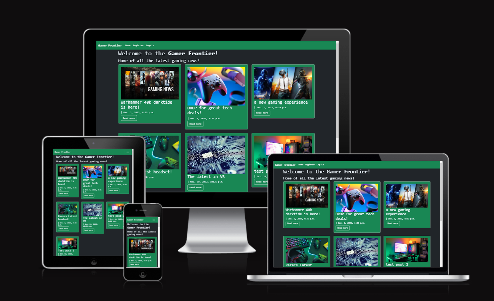

the live site can be viewed [HERE](https://gamer-frontier.herokuapp.com) 

## Table of Contents
+ [UX](#ux "UX")
  + [Site Purpose](#site-purpose "Site Purpose")
  + [Site Goal](#site-goal "Site Goal")
  + [Audience](#audience "Audience")
  + [Communication](#communication "Communication")
  + [Current User Goals](#current-user-goals "Current User Goals")
  + [New User Goals](#new-user-goals "New User Goals")
+ [User Stories](#user-stories "User Stories")
  + [Admin stories](#admin-stories "Admin stories")
  + [Artist stories](#artist-stories "Artist stories")
  + [Visitor stories](#visitor-stories "Visitor stories")
+ [Design](#design "Design")
  + [Imagery](#imagery "Imagery")
+ [Features](#features "Features")
  + [Existing Features](#existing-features "Existing Features")
  + [C.R.U.D](#crud "C.R.U.D")
+ [Testing](#testing "Testing")
  + [Validator Testing](#validator-testing "Validator Testing")
  + [Unfixed Bugs](#unfixed-bugs "Unfixed Bugs")
+ [Technologies Used](#technologies-used "Technologies Used")
  + [Main Languages Used](#main-languages-used "Main Languages Used")
  + [Frameworks, Libraries & Programs Used](#frameworks-libraries-programs-used "Frameworks, Libraries & Programs Used")
+ [Deployment](#deployment "Deployment")
+ [Credits](#credits "Credits")
  + [Content](#content "Content")
  + [Media](#media "Media")

## UX

### Site Purpose:
This site was built with the gaming community in mind, hoping to encompass recent gaming news and gaming technology news in the posts. The site is laid out so that you will always see the most recent posts first. Users may also submit their own posts for review if they would like to contribute, in an attempt to make the site community driven. 

### Site Goal:
This sites goal is to provide recent and accurate gaming/technology news, with community feedback and contribution. 

### Audience:
The targeted audience is the gaming community and technology enthusiasts. 

### Communication:
The simple layout was designed to allow a users communication with the layout as easy and intuitive as possible.

### Current User Goals:
To allow users quick and easy access to the latest news based on gaming and technology. 

### New User Goals:
To find useful and interesting information from a well laid out website. 

### Future Goals:
- To have mini games available on the site
- Add ongoing game and tech deals availble online at the time
- A subscribable newsletter
- better UI and content layout
- video content
- popular livestreams section
- allow user profiles to have more depth (eg. a bio, profile picture, friends)
- an internal messaging system

## User Stories


### Admin stories:
#### As an admin:
1. I can **submit new blog posts** so that **I can inform site visitors & artists of new events, artists, and more**.
 - Story points: 3
2. I can **moderate blog comments** so that **the feedback provided is appropriate**.
 - Story points: 1
3. I can **create a log in / sign up page** so that **artists and visitors can sign up to the site**.
 - Story points: 2


### Visitor stories:
#### As a visitor:
1. I can **visit the blog** so that **I can see what is new**.
 - Story points: 5
2. I can **Create a user profile** giving me **access to site features**.
  - Story points: 4
3. I can **comment on blog posts** so that **I can give my feedback**.
 - Story points: 2
4. I can **like blog posts** so that **I can easily share my enthusiasm**.
 - Story points: 1
5. I can **create a blog post** so i can **engage with the site**.
 - Story points: 4

## Design

### Wireframes:

##### Home Page: 
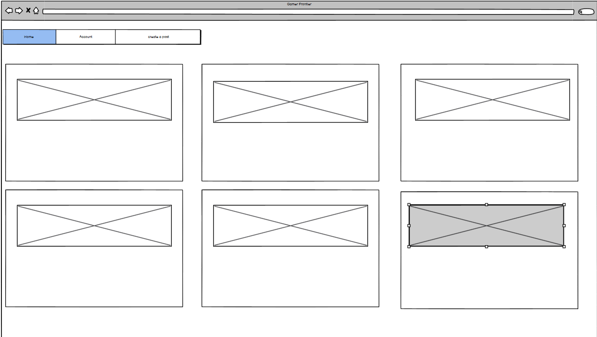


##### Blog Post Details:
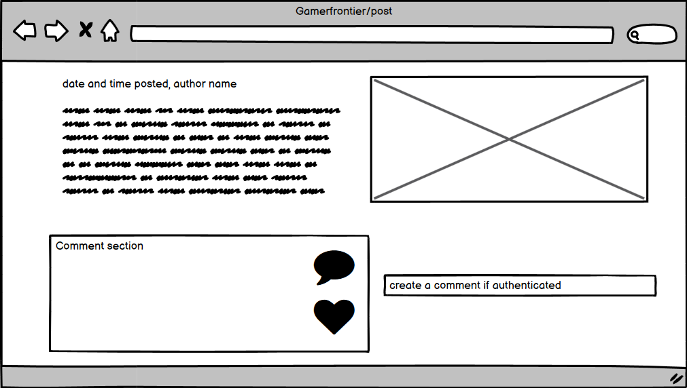

##### Site Navigation:
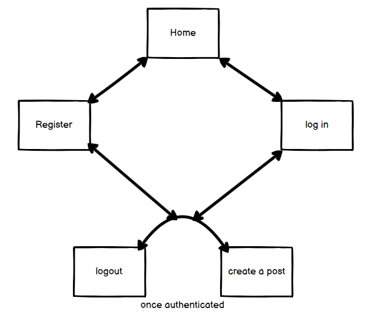

### Database Schema
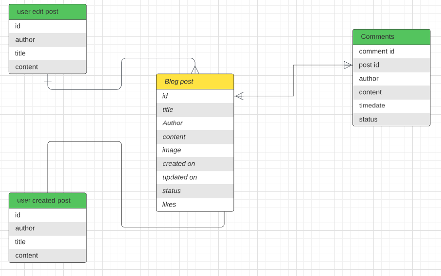


### Imagery:
All images on the site were pulled from google images using searches of 'gaming new' or 'gaming technology'.

## Features

### Existing Features:

#### Home Page:


#### Navigation Bar:

##### Desktop:


##### Mobile:

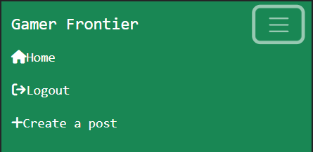


#### Blog Post Details:


#### Log in, Log out & Sign up:

##### Login:

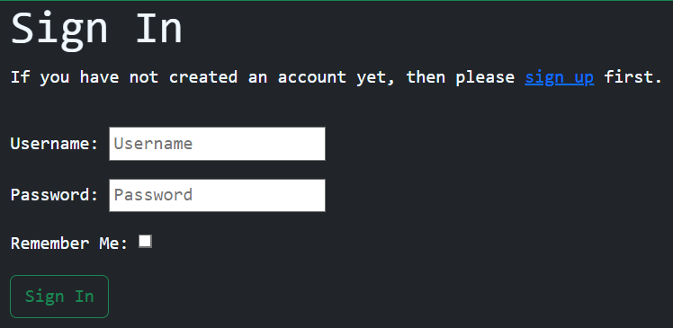

##### Logout:

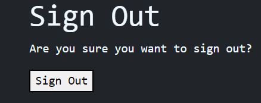

##### Register account:

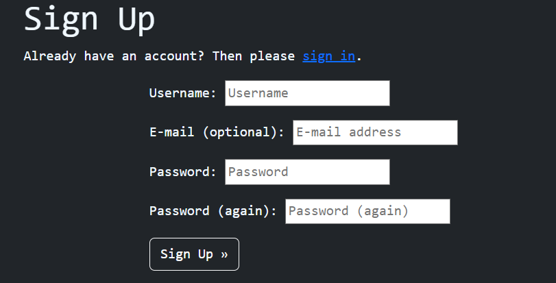


### C.R.U.D:

#### Create (button):
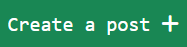
This button allows a logged in user to access the blog post creation form. 

#### Create (form):
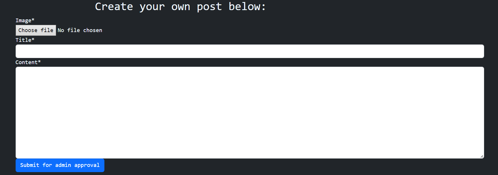
This form is only accesible to logged in users and allows them to submit a post of their own to be moderated and published if applicable. 

#### Create(comment): 

Logged in users can also post comments underneath any published blog post. 

#### Read:

All posts are readable whether a user is logged in or not. 

#### Update & Delete:

Authors of a post may edit or delete the blog post. 

### Features Left to Implement
- Online shop
- comment edit/delete
- in-depth profiles
- Contact page
- Password reset
- Social media sign-in
- minigames
- messaging system

## Testing
1. index.html page not loading:
 - Through trial and error, I changed the view code from a class to a function.
 - as well as removed the ```.as_view()``` from the URL path.

2. CSS styles not loading on blog page:
 - This [Django tutorial](https://docs.djangoproject.com/en/4.0/intro/tutorial06/) indicated that the styles were incorrectly linked.
 - This was resolved updating the href link in the base.html to ``````

3. Error message after installing Allauth:
 - Tutor support informed me that Heroku had updated my database url value.
 - This was resolved by updating the env.py file with the new URL.

4. Invalid "syntax" error after installing **crispy-forms**:
 - A comma was missing from within the BlogPost class.

5. Django error message after adding comment form:
 - CSRF token had been added as CRSF.
 - Correcting the error resolved the issue.

6. Static files refused to load on live site: 
  - Forgetting to turn debug mode off causes static files to remain unloaded. 

7. Post submission form unable to complete:
 - Terminal error suggested no file was selected.
 - I read numerous articles on stackoverflow, cloudinary, comments on slack, and was unable to resolve this.
 - tutor support talked me through what was going wrong, i had mislabelled a class as a function
 - Fixing this resolved the issue.

8. Testing CRUD functionality:
 - Each of the features were tested multiple times to ensure that numerous new posts could be submitted, and that each post had the ability to be updated and edited by the user that submitted it.
 - If a post is submitted by another user, the edit/delete buttons do not appear on the page.
.

### Validator Testing
- html files pass through the [W3C validator](https://validator.w3.org/) with no html issues found
- Errors listed only reference  & {{}} tags.

- CSS files pass through the [Jigsaw validator](https://jigsaw.w3.org/css-validator/) with no issues found.

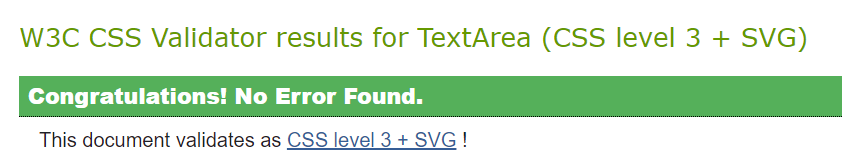

- page has an excellent performance rating in Lighthouse

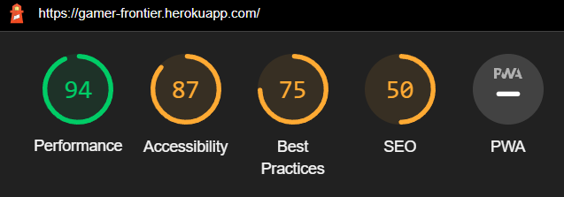

- Python files could not be validated through Pep8online as it seems to have deprecated, however using the pypi Pep8 everything was kept within spec with the exception of some of the django based imports. 

- Tested the site opens in firefox, Chrome & Opera GX without issues.

### Unfixed Bugs
- Image upload uploads a string of the images data rather than the image itself. 
- images changing the cards height instead of remaining uniform

## Technologies Used
### Main Languages Used
- HTML5
- CSS3
- Javascript
- Python
- Django
- SQL - Postgres

### Frameworks, Libraries & Programs Used
- Font Awesome - to add icons to the social links in the footer element.
- GitPod - to create my html files & styling sheet before pushing the project to Github.
- GitHub - to store my repository for submission.
- Balsamiq - were used to create mockups of the project prior to starting.
- Am I Responsive? - to ensure the project looked good across all devices.
- google images - for photo collection
- Django
- Bootstrap

### Installed Packages:
- 'django<4' gunicorn
- dj_database_url psycopg2
- dj3-cloudinary-storage
- django-summernote [(link)](https://summernote.org/)
- django-allauth [(link)](https://django-allauth.readthedocs.io/en/latest/)
- django-crispy-forms[(link)](https://django-crispy-forms.readthedocs.io/en/latest/index.html)

## Deployment
The site was deployed to Heroku. The steps to deploy are as follows:
- Install Django & Gunicorn:
```pip3 install 'django<4' gunicorn```
- Install Django database & psycopg:
```pip3 install dj_database_url psycopg2```
- Install Cloudinary:
```pip3 install dj3-cloudinary-storage```
- Creating the requirements.txt file with the following command:
```pip3 freeze --local > requirements.txt```
- a django project was created using:
```django-admin startproject printstatements .```
- the blog app was then created with:
```python3 manage.py startapp blog```
- which was then added to the settings.py file within our project directory.
- the changes were then migrated using:
```python3 manage.py migrate```
- navigated to [Heroku](www.heroku.com) & created a new app called print-statements.
- added the Heroku Postgres database to the Resources tab.
- navigated to the Settings Tab, to add the following key/value pairs to the configvars:
1. key: SECRET_KEY | value: randomkey
2. key: PORT | value: 8000
3. key: CLOUDINARY_URL | value: API environment variable
4. key: DATABASE_URL | value: value supplied by Heroku
- added the DATABASE_URL, SECRET_KEY & CLOUDINARY_URL to the env.py file
- added the DATABASE_URL, SECRET_KEY & CLOUDINARY_URL to the settings.py file
- add an import os statement for the env.py file.
- added Heroku to the ALLOWED_HOSTS in settings.py
- created the Procfile
- pushed the project to Github
- connected my github account to Heroku through the Deploy tab
- connected my github project repository, and then clicked on the "Deploy" button

- The live link for "Gamer-Frontier" can be found [HERE](https://gamer-frontier.herokuapp.com)

## Credits

### Content
- [Lauren-Nicole](https://github.com/CluelessBiker): Forever helpful on the slack channels and helped me sort out a few issues. 
- “I think therefore I blog” walkthrough: Provided the initial steps for setting up & deploying the site, as well as this, I also used the instructions they provided in order to implement a django blog into my app, following the walkthrough once again step-by-step. This also includes some formatting for the way each blog post is displayed on the blog page. Credits have been added as comments where code was used.
- "I think therefore I blog" + "Hello Django" + Slack + Stackoverflow: aided in the creation of the CRUD functions.
- Ger from Tutor support: assistance deciphering an error I could not understand. Re-linking the Heroku database in the env.py file with the new value resolved this.
- Tutor support was invaluable for little issues i ended up stuck on such as working with views and forms in Django.
- [Bootstrap](https://getbootstrap.com/docs/5.2/components/dropdowns/): dropdown nav menu.
- "Hello Django": The two tests implemented in this project were reused from the walkthrough project.

### Media
- All images were borrowed from google images. 
- All post content was generated by me. 
